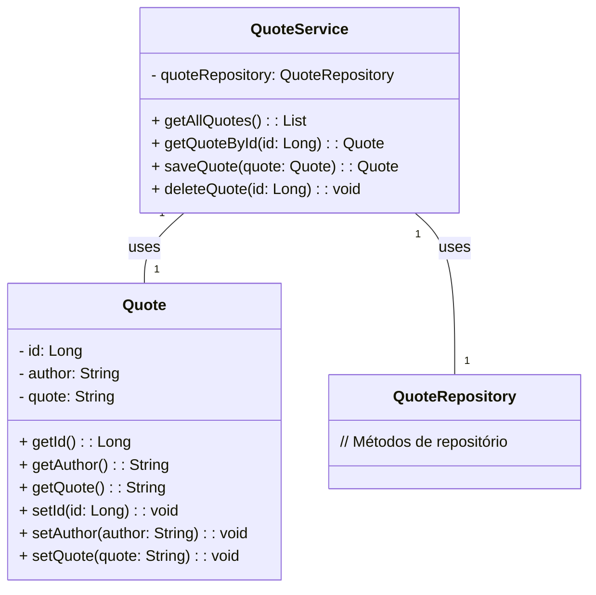

# Quote-generator

Esse é um projeto criado usando todo o aprendizado no Bootcamp FullStack Java da Santander.

# Projeto de Exemplo - Citações

Este é um projeto de exemplo que demonstra um sistema de gerenciamento de citações. O projeto foi desenvolvido em Java usando o framework Spring Boot.

## Funcionalidades

- Exibir citações aleatórias.
- Listar todas as citações.
- Adicionar novas citações.
- Remover citações existentes.

## Tecnologias Utilizadas

- Java
- Spring Boot
- Spring Data JPA
- H2 Database (usado para armazenar as citações)
- Spring Web (para criar um controlador REST)
- Mermaid (para gerar um diagrama de classes)
- Swagger (para documentação da API)
- MySQL (banco de dados utilizado em produção)

## Como Executar o Projeto

Certifique-se de que você possui o Java JDK instalado na sua máquina. Você pode baixá-lo em [AdoteOpenJDK](https://adoptopenjdk.net/).

